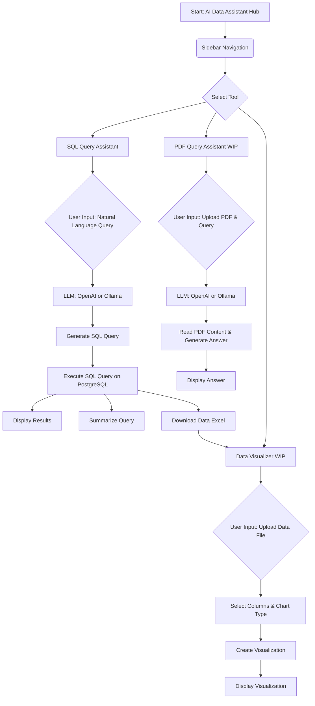

# AI Data Assistant Hub

This application provides AI-powered tools for interacting with data, built with Streamlit, OpenAI, and Ollama.

## Features

Currently includes:

* **SQL Query Assistant**: Allows users to query a database using natural language. (Currently supports PostgreSQL only).
* **PDF Query Assistant**: (Work in Progress)
* **Data Visualizer**: (Work in Progress)

## Getting Started

1.  Select the assistant you need from the sidebar navigation.
2.  Follow the instructions provided on that specific tool's page.
3.  Ensure any necessary connections (like database access or a running Ollama server) are active.

### Prerequisites

* Python 3.x
* The required libraries listed in `requirements.txt`.

### Installation

1.  Clone the repository.
2.  Install the required libraries:
    ```bash
    pip install -r requirements.txt
    ```

### Configuration

**Note:** Currently, the API key and database connection and data table (column names types and descriptions) information are handled directly within the Python code (`app.py` and the 3 pages) and are not secured. Users will need to modify the code directly to set these parameters.

* **API Key:** Locate where the API key is used in the code (all 3 pages) and replace the placeholder with your actual API key.
* **Database Info:** Locate where the database connection is established in the code (sql.py page) and update the connection details (e.g., host, database name, user, password) for your PostgreSQL database.
* **Data Table Info:** Locate where the data table information (column names types and descriptions) is stated in the code (sql.py page) system prompt and update for your PostgreSQL table.

**Warning:** This method of handling sensitive information like API keys is not secure. Plz be careful :)

### Running the Application

```bash
streamlit run app.py
```

### Workflow Overview


